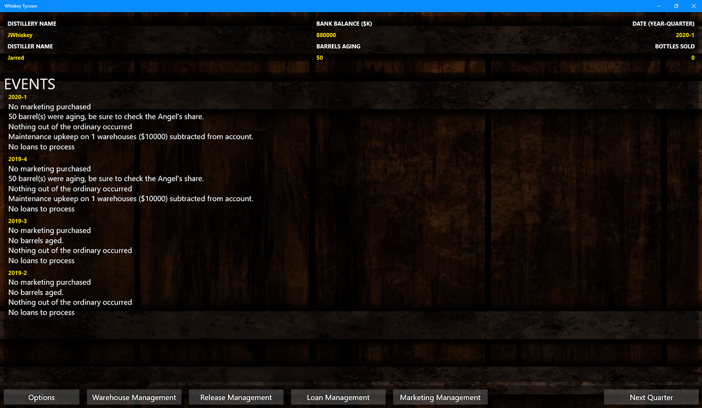

# Whiskey Tycoon
A tycoon simulation of running a Whiskey Distillery.

## Features
* Warehouse Management
* Release Management
* Marketing Management
* Distribution Management
* Loan Management

## Tentative Release Timeline

### Alpha 1 (December 31st 2018)
Feature complete, but not polished release (https://github.com/jcapellman/Whiskey-Tycoon/releases/tag/v0.1-alpha-1)

### Alpha 2 (January 5th 2019)
Polished version of Alpha 1 with bug fixes (https://github.com/jcapellman/Whiskey-Tycoon/releases/tag/v0.2-alpha-2)

### Alpha 3 (January 2019)
Added graphics with bug fixes

### Beta 1 (Q1 2019)
Release for public feedback

Future Betas may be released depending on feedback
